# Lógica

[](#)
[](#)

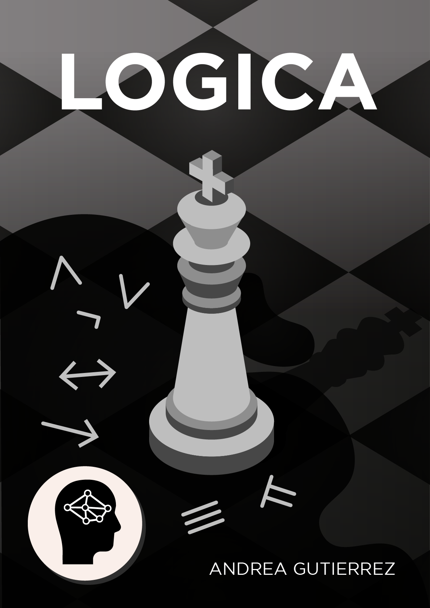

[](#)

# Introducción a la lógica

## Lógica

### ¿Qué es la Lógica?

La lógica es el estudio del razonamiento, la inferencia y la validez. Proporciona un entorno formal y sistemático para analizar y evaluar argumentos.

**Aspectos Clave:**

- **Razonamiento:** Analiza cómo se extraen conclusiones a partir de premisas dadas utilizando un razonamiento válido.
- **Inferencia:** Ofrece herramientas para derivar nuevos conocimientos o conclusiones basadas en información existente.
- **Validez:** Determina si un argumento es válido si la conclusión sigue lógicamente de las premisas, independientemente de la verdad o falsedad de estas.
- **Formalización:** Usa lenguajes formales y representaciones simbólicas para expresar ideas complejas de manera precisa y sin ambigüedades.

### Lenguaje Formal vs. Lenguaje Natural

| Aspecto | Lenguaje Formal | Lenguaje Natural |
| --- | --- | --- |
| **Precisión** | No ambiguo con reglas estrictas de sintaxis y semántica. | Inherentemente ambiguo y dependiente del contexto. |
| **Expresividad** | Limitado en expresividad, con estructuras predefinidas. | Altamente expresivo, permite una amplia gama de matices. |
| **Rigor** | Permite razonamiento preciso y análisis riguroso. | Más flexible y abierto a interpretación, menos riguroso. |

## Lenguajes Formales y Proposiciones

### ¿Qué es un lenguaje formal?

Un **lenguaje formal** se define por los **símbolos** (**sintaxis**) y las **reglas** para manipular esos símbolos (**semántica**), lo cual nos ayuda a representar el conocimiento y razonar con él.

- **Sintaxis:** Son todos los símbolos y notaciones.
- **Semántica:** Es el significado de los símbolos.

Un lenguaje formal es:

- Un canal de comunicación.
- Una manera de comunicarnos con las máquinas.
- Nos permite definir o comunicarnos con el computador.

### Lógica Proposicional

 Es una rama de la lógica matemática que estudia las proposiciones (enunciados que pueden ser verdaderos o falsos) y las conexiones lógicas entre ellas. Utiliza símbolos y reglas para analizar y evaluar la validez de argumentos.

- **Valores:** **verdadero y falso** (0 y 1 ; TRUE y FALSE).
- Las proposiciones se pueden combinar utilizando **operadores Booleanos**.

Características de la lógica proposicional:

- No depende del estado de ánimo.
- Es la lógica de 0 y 1, usada por las computadoras.
- Los computadores cuánticos usan decimal.

### Abstracción

- Una **abstracción** nos permite representar nuestras observaciones del mundo para razonar sobre él.
- Para construir y estudiar una abstracción, necesitamos definir un **conjunto** preciso **de reglas** que capturen el conocimiento en las observaciones.
- Utilizando una abstracción, podemos analizar la veracidad o falsedad de nuestras observaciones y generalizar estos resultados.

¿Por qué necesitamos reglas formales para definir abstracciones?

- Necesitamos representar nuestras observaciones de la manera más precisa posible.
- Con estas representaciones, podemos analizar si una abstracción es verdadera en cada interpretación (generalización) o siempre es falsa.
- Podemos construir una secuencia de razonamiento para inferir nuevos resultados utilizando reglas de transformación.

### Silogismo

Es un tipo de razonamiento deductivo que consta de dos premisas (afirmaciones) de las cuales se obtiene una conclusión lógica. Es como una cadena de razonamiento donde la conclusión se sigue necesariamente de las premisas.

Ejemplo:

- **Premisa 1:** Todos los perros tienen cuatro patas.
- **Premisa 2:** Bobby es un perro.
- **Conclusión:** Por lo tanto, Bobby tiene cuatro patas.

Silogismo de Smullyan

- **Premisa 1: Algunos perros** son vegetarianos.
- **Premisa 2:** Mi perro es **algún perro.**
- **Conclusión:** Por lo tanto, mi perro es vegetariano.

 El lenguaje natural puede ser ambiguo.

### Preguntas

Las teorías lógicas pueden tener propiedades deseables:

- **Consistencia:** ¿es posible probar una afirmación y su negación?
- **Independencia:** ¿son los **axiomas** independientes entre sí?
- **Corrección:** ¿son verdaderas las afirmaciones inferidas?
- **Completitud:** ¿se pueden probar todas las afirmaciones verdaderas dentro del sistema?

### Aplicaciones de la lógica a la Computación

- Diseño de circuitos (lógica booleana)
- Verificación de hardware
- Verificación de software (verificación de modelos)
- Lenguajes de programación (sintaxis, semántica axiomática, semántica denotacional, sistemas de tipos)

## Proposición

Una proposición es una declaración que puede ser verdadera o falsa, pero no ambas a la vez. Es decir, afirma o niega algo de manera concreta.

Ejemplo: 

- "La primera computadora digital electrónica fue la ENIAC. " es una proposición, ya que se puede determinar su valor de verdad.

### No-proposiciones:

- **Oraciones desiderativas**: Expresan deseos.
    - Ejemplo: "Ojalá el algoritmo no tenga errores."
- **Oraciones interrogativas**: Formulan preguntas.
    - Ejemplo: "¿Cuál es tu software favorito?"
- **Oraciones exclamativas**: Expresan sorpresa o admiración.
    - Ejemplo: "¡Qué hermoso es el atardecer!"
- **Oraciones exhortativas o imperativas**: Usadas para dar órdenes, rogar, pedir, prohibir, mandar.
    - Ejemplo: "Por favor, enciende tu cámara."

### Variables Proposicionales

Las proposiciones se representan mediante variables proposicionales simbolizadas con letras. Adoptaremos las letras 'p', 'q', 'r', 's', etc., y eventualmente las mismas con subíndices. 

Ejemplo:

- La proposición "Alan Turing fue un pionero en el campo de la computación." se puede asignar a la variable proposicional ‘p’.
- La proposición "La World Wide Web fue creada por Tim Berners-Lee." se puede asignar a la variable proposicional ‘q’.

### ¿Cuáles son proposiciones?

| Ejemplo/Ejercicio | ¿Es Proposición? | Razón |
| --- | --- | --- |
| "El átomo es una molécula." | Sí | Es una afirmación que puede ser verdadera o falsa. En este caso, es falsa. |
| "¿Qué es la lógica?" | No | Es una pregunta, no una afirmación. |
| "Debemos honrar a los héroes de la Patria." | No | Es una expresión de deseo u obligación, no una afirmación que pueda ser verdadera o falsa. |
| "En buena hora." | No | Es una expresión, no una afirmación. |
| "¡Por las barbas de Lucifer!" | No | Es una exclamación, no una afirmación. |
| "¡Casi me saco la lotería!" | No | Es una exclamación, no una afirmación que pueda ser verdadera o falsa. |
| "Quizá llueva mañana." | No | Es una expresión de incertidumbre, no una afirmación definitiva. |
| "Z + 7 = 9." | No | Es una declaración matemática. Aunque puede ser verdadera o falsa dependiendo del valor de Z, no es una proposición en sí misma. |
| "X es una ciudad de Argentina." | No | Es una afirmación, pero es indefinida porque no se especifica qué es "X". |

### Tipos de Proposiciones

- **Proposiciones Atómicas**:
Son proposiciones simples sin conectores de enlace (y, o, si...entonces, si y sólo si) o negación. Expresan un único pensamiento.
    - Ejemplos:
        - "Hoy es jueves." (p)
        - "Las calles están iluminadas." (r)
- **Proposiciones Moleculares**:
Son la unión de varias proposiciones atómicas mediante conectores de enlace o la negación.
    - Ejemplos:
        - "La luna no está hecha de queso." (una proposición atómica negada)
        - "Los elefantes son mamíferos y los pájaros son ovíparos." (dos proposiciones atómicas unidas por el conector “y”)

### Los Conectores

Para estudiar proposiciones atómicas nos limitamos bastante, por lo que introducimos una serie de conectores que nos permiten construir proposiciones complejas:

| Nombre en Logico | Símbolo | Significado | Proposición Compuesta | Valor de Verdad |
| --- | --- | --- | --- | --- |
| Conjunción | ∧ | Y | p ∧ q | Verdadero si p y q son verdaderos. |
| Disjunción | ∨ | O | p ∨ q | Falso solo si p y q son falsos. |
| Negación | ¬ | No | ¬p | Verdadero si p es falso. |
| Implicación | → | Si … Entonces | p → q | Falso solo si p es verdadero y q es falso. |
| Bicondicional | ↔ | Si y solo si | p ↔ q | Verdadero si p y q son ambos verdaderos o ambos falsos. |
- **Conjunción (∧)**: Combina dos proposiciones de manera que la nueva proposición resultante es verdadera sólo si ambas proposiciones originales son verdaderas.
    - Ejemplo: "El computador está encendido y el archivo ha sido guardado correctamente."
- **Disyunción (∨)**: Combina dos proposiciones y la nueva proposición resultante es verdadera si al menos una de las proposiciones originales es verdadera.
    - Ejemplo: "El computador está encendido o el archivo ha sido guardado correctamente."
- **Negación (¬)**: Se utiliza para negar una proposición. La nueva proposición resultante es verdadera si la proposición original es falsa, y viceversa.
    - Ejemplo: "¬ Hoy es lunes" es verdadera si “Hoy es lunes” es falsa.
- **Implicación (**→**)**: Indica que una proposición implica otra. La nueva proposición resultante es falsa sólo si la primera proposición es verdadera y la segunda es falsa.
    - Ejemplo: "Si el computador está encendido entonces el archivo ha sido guardado correctamente."
- **Bicondicional (**↔**)**: Indica que dos proposiciones son equivalentes; la nueva proposición es verdadera si ambas proposiciones originales son ambas verdaderas o ambas falsas.
    - Ejemplo: "Hoy es lunes ↔ está soleado."

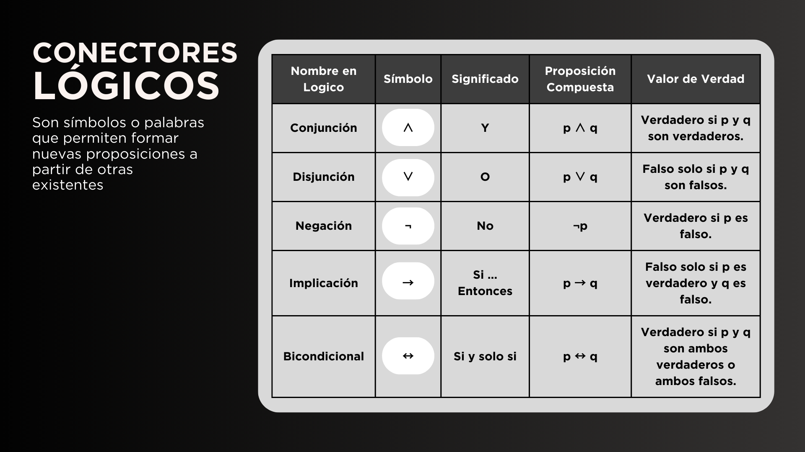

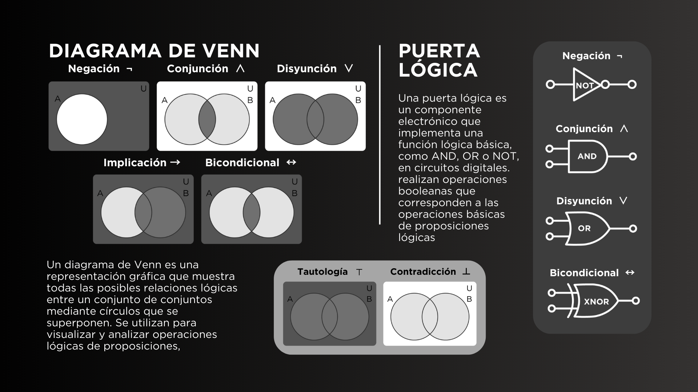

## Argumentos Correctos

Un razonamiento es válido si la conclusión sigue lógicamente de las premisas.

¿Cuando es válido un razonamiento?

**Ejemplo 1:**

- Premisa 1: Todos los seres humanos son mortales.
- Premisa 2: Juan es un ser humano.
- Conclusión: Por lo tanto, Juan es mortal.

**Ejemplo 2:**

- Premisa 1: Todos los unicornios son mamíferos.
- Premisa 2: Jorge es un unicornio.
- Conclusión: Por lo tanto, Jorge es un mamífero.

### Semántica

La semántica define posibles interpretaciones de formulas.

p ∧ q : Verdadero si p y q son verdaderos.

q ∧ ¬ r: Falso si q es verdadero y r es verdadero.

### Lenguaje LaTeX

LaTeX es un sistema para escribir documentos técnicos y científicos que incluyen matemáticas y otros elementos complejos, usando comandos especiales en lugar de formatos visuales directos como en Word.

.png)

| Conector | Símbolos | Ejemplo | Código LaTeX |
| --- | --- | --- | --- |
| Conjunción | ∧, &, . | p ∧ q | `\\land` |
| Disjunción | ∨, │, + | p ∨ q | `\\lor`, `\\vert` |
| Negación | ¬, ~ | ¬p | `\\neg`, `\\sim` |
| Implicación | →, ⊃, ⇒ | p → q | `\\Rightarrow`, `\\supset`, `\\Rightarrow` |
| Bicondicional | ↔ , ⇔ | p ↔ q | `\\leftrightarrow`  , `\\Leftrightarrow` |

### Falacia

Fallacia, que significa engaño. Consiste en un procedimiento de extrapolación o generalización que no se sostiene en premisas lógicas, sino que se da de modo arbitrario. 

Estas generalizaciones conducen a malas inducciones y conclusiones erróneas

- **Falacias Formales:** Errores en la estructura lógica de un argumento. Violaciones de las estructuras deductivamente válidas.
- **Falacias No Formales:** Errores en el contenido o la información de las premisas.

## Demostraciones en Matemáticas

Una demostración matemática es una serie de pasos lógicos para demostrar un argumento. Una vez que ha sido demostrado, se convierte en un teorema.

**Pasos para demostrar un teorema:**

1. Definir el enunciado del problema.
2. Identificar premisas y definiciones.
3. Construir el argumento lógico.
4. Utilizar estrategias de demostración:
    - Demostración directa.
    - Demostración por contradicción.
    - Demostración por inducción.
5. Justificar cada paso con rigor y precisión.
6. Concluir.

### Técnicas y tipos de demostraciones matemáticas:

Existen varias técnicas y tipos de demostraciones matemáticas, cada una adecuada para diferentes situaciones y tipos de afirmaciones. A continuación, se describen algunas de las más comunes:

| **Técnica de Demostración** | **Descripción** | **Ejemplo** |
| --- | --- | --- |
| **Demostración por Dedución** | Parte de premisas o axiomas y llega a una conclusión mediante una secuencia lógica. | La suma de dos números pares es par. Si a = 2k y b = 2m, entonces a + b = 2(k + m), que es par. |
| **Demostración por Contraejemplo** | Muestra que una afirmación es falsa proporcionando un único ejemplo que no cumple con la afirmación. | “Todos los números primos son impares” es falso porque el número 2 es primo y par. |
| **Demostración por Casos** | Divide el problema en varios casos y demuestra que la afirmación es verdadera en cada uno de ellos. | El producto de dos números enteros es par si al menos uno es par. Se considera el caso de al menos uno par y el caso en que ambos son pares. |
| **Demostración por Contradicción** | Asume que la afirmación es falsa y llega a una contradicción lógica, lo que implica que la afirmación original es verdadera. | Demostrar que √2 es irracional. Supongamos que (√2) es racional y derive una contradicción. |
| **Demostración por Inducción Matemática** | Técnica para probar una afirmación sobre todos los números naturales, usando una base y un paso inductivo. | Demostrar que la suma de los primeros n números naturales es $\frac{n(n+1)}{2}.$ |

Cada una de estas técnicas proporciona un enfoque estructurado para establecer la veracidad de afirmaciones matemáticas, garantizando rigor y precisión en las demostraciones.

---

# Sintaxis y Semántica de la Lógica Proposicional

## Fórmulas Bien Formadas

En lógica proposicional, un lenguaje formal se define por la notación (sintaxis) y las reglas para manipular esa notación (semántica). Las fórmulas bien formadas (WFF) son las expresiones válidas en el lenguaje.

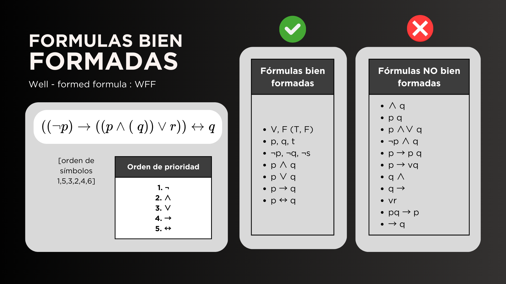

Abreviaturas:

- FBF, fbf: fórmula bien formada
- WFF, wff: well-formed formula

### Sintaxis

La sintaxis representa los símbolos que se utilizan y su orden correcto de secuenciación. Los símbolos básicos en la lógica proposicional son:

- **Constantes:**
    - V (Verdadero)
    - F (Falso)
- **Variables Proposicionales:** p, q, r, s, …
- **Operadores:**
    - Conector Unario ¬
    - Conector Binario ∧, ∨, →, ↔

### Reglas de Sintaxis

No todas las secuencias de símbolos son válidas. Las reglas para construir una fórmula válida, llamada fórmula bien formada (WFF), son las siguientes:

1. Una constante es una WFF.
2. Una **variable proposicional** es una WFF.
3. Si P es una WFF, entonces ¬P es una WFF (Negación).
4. Si P y Q son WFF, entonces P ∧ Q es una WFF (Conjunción).
5. Si P y Q son WFF, entonces P ∨ Q es una WFF (Disyunción).
6. Si P y Q son WFF, entonces P → Q es una WFF (Implicación).
7. Si P y Q son WFF, entonces P ↔ Q es una WFF (Bicondicional).

### Precedencia de Operadores

La precedencia de los operadores lógicos establece el orden en el que se deben evaluar las expresiones lógicas. El orden de precedencia, de mayor a menor, es:

1. ¬ (Negación)
2. ∧ (Conjunción)
3. ∨ (Disyunción)
4. → (Implicación)
5. ↔ (Bicondicional)

**Ejemplos de Evaluación:**

1. P ∧ Q ∨ ¬R
    - Evaluación: (P ∧ Q) ∨ ¬R
2. P ∧ Q ↔ Q ∧ P
    - Evaluación: (P ∧ Q) ↔ (Q ∧ P)
3. P ∨ ¬Q ∧ R ∧ ¬R → S ↔ T
    - Evaluación: (((P ∨ (¬Q ∧ R)) ∧ ¬R) → S) ↔ T

### Uso de Paréntesis

Los paréntesis se utilizan para eliminar ambigüedad y clarificar la estructura de las expresiones lógicas. A veces, las secuencias con operadores pueden ser ambiguas. Para eliminar la ambigüedad, utilizamos paréntesis.

Ejemplos:
a. p ∧ (q ∨ ¬r)
b. p ∧ ((q ↔ r) ∨ ¬r)

Las reglas mencionadas anteriormente se describen a veces de la siguiente manera: si P y Q son WFF, entonces (P ∨ Q) es una WFF.

**Ejemplos:**

1. p ∧ (q ∨ ¬r)
2. p ∧ ((q ∨ ¬r) ∨ ¬r)

### Árbol Sintáctico

Un árbol sintáctico es una representación jerárquica de la estructura de una fórmula lógica. Cada nodo interno representa un operador lógico, y las hojas representan variables o constantes. Este tipo de representación ayuda a visualizar la precedencia de los operadores y la estructura subyacente de la expresión.

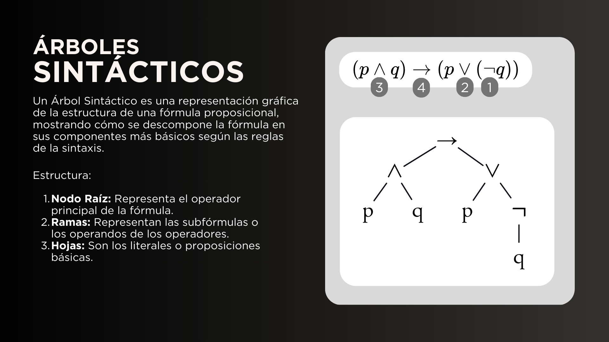

### Árbol de Formación

Un árbol de formación muestra cómo se construye una fórmula bien formada (WFF) a partir de sus componentes básicos. Cada nodo representa una subfórmula o un operador lógico, y las hojas del árbol representan las variables proposicionales.

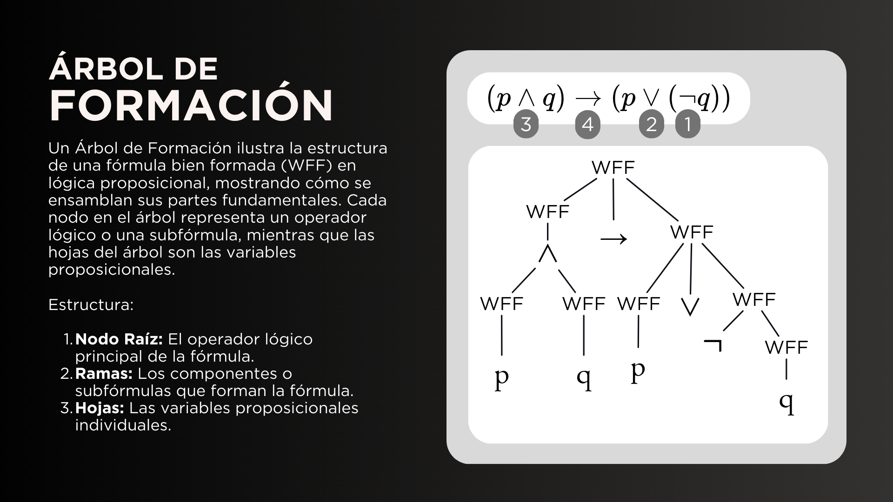

### Semántica

Usamos los operadores como reglas de razonamiento para asignar valores de verdad y analizar todas las posibilidades, sean o no verdaderas. Estas "posibilidades" dependen de los operadores. Cuando analizamos fórmulas lógicas y tomamos en cuenta todas las posibilidades, se generan escenarios llamados interpretaciones.

- ¿Cómo podemos interpretar una fórmula bien formada (WFF)?
- ¿Qué significado tiene una fórmula bien formada (WFF)?

### Interpretación

La interpretación es la asignación de valores de verdad a proposiciones en una fórmula.

**Ejemplos:**

1. Si asignamos a la variable p el valor V, entonces la fórmula p es V.
2. Si asignamos a la variable p el valor V, entonces la fórmula ¬p es F.
3. Para asignar un valor a ¬p ∧ q necesitamos asignaciones a p y q. Si p es V y q es F, entonces la fórmula ¬p ∧ q es F.

La asignación de valores a p y q se denomina interpretación.

### Interpretación de Operadores

Cuando calculamos el valor de verdad de una fórmula bien formada (WFF), encontramos operadores. Se definen los valores de verdad para todas las interpretaciones de un operador:

1. La constante True (Verdadero) tiene un valor de T, y False (Falso) tiene un valor de F.
2. Una variable proposicional puede tener un valor T o F, según la asignación dada.
3. La WFF ¬P tiene el valor F si P tiene el valor T, y T si P tiene el valor F.
4. La WFF P ∧ Q es T solo cuando P y Q tienen el valor T; de lo contrario, es F.
5. La WFF P ∨ Q es F solo cuando P y Q tienen el valor F; de lo contrario, es T.

### Tablas de Verdad

Las tablas de verdad se utilizan para determinar el valor de verdad de las fórmulas lógicas en función de los valores de verdad de sus variables. Se puede construir una tabla de verdad con las condiciones mencionadas anteriormente, es decir, podemos calcular todas las interpretaciones posibles de una fórmula bien formada (WFF) combinando todos los posibles valores de verdad en una tabla.

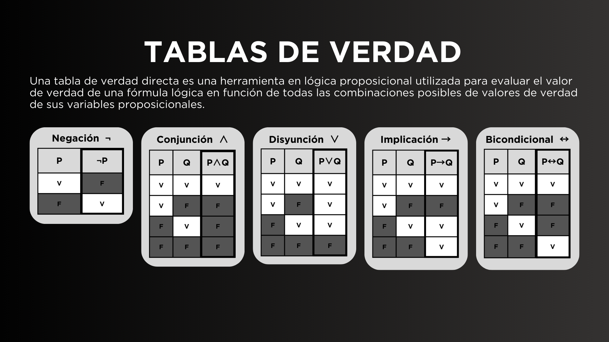

**Ejemplo:**

Para la fórmula S: (p → q) → ((¬p) → (¬q)):

| p | q | p → q | ¬p | ¬q | (¬p) → (¬q) | S |
| --- | --- | --- | --- | --- | --- | --- |
| V | V | V | F | F | V | V |
| V | F | F | F | V | V | V |
| F | V | V | V | F | F | F |
| F | F | V | V | V | V | V |

### Operadores Lógicos en Diferentes Lenguajes de Programación

| Operador | Python | Java | C# | Pseudocódigo |
| --- | --- | --- | --- | --- |
| Conjunción (y) | and | && | && | AND |
| Negación (no) | not | ! | ! | NOT |
| Disyunción (o) | or | || | || | OR |

---

## Propiedades y Relaciones de las Fórmulas Proposicionales

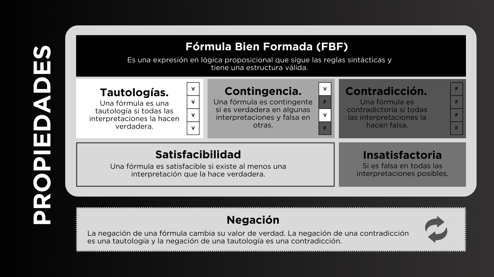

### Satisfacibilidad

Una fórmula bien formada (WFF) es satisfacible cuando existe al menos una interpretación que la hace verdadera.

**Ejemplo 1:** La fórmula (p ∧ q) ∨ ¬p es satisfacible. Una interpretación que la hace verdadera es:

- I(p) = V (verdadera) y I(q) = F (falsa).
    - Evaluación: (V ∧ F) ∨ ¬F resulta en F ∨ T, que es T (verdadera).

**Ejemplo 2:** La fórmula p ∨ (q ∧ ¬p) es satisfacible. Una interpretación que la hace verdadera es:

- I(p) = V y I(q) = F.
    - Evaluación: V ∨ (F ∧ ¬V) resulta en V ∨ F, que es V (verdadera).

### Contradicción

Una fórmula bien formada es contradictoria cuando todas las interpretaciones la hacen falsa. Es decir, todas las interpretaciones producen un valor falso para la fórmula (no es satisfacible).

**Ejemplo 1:** La fórmula p ∧ ¬p es contradictoria. Sin importar la interpretación de p, ¬p siempre tendrá el valor opuesto, haciendo que la fórmula sea siempre falsa.

**Ejemplo 2:** La fórmula (p ∨ q) ∧ ¬(p ∨ q) es contradictoria porque no puede ser verdadera en ninguna interpretación.

### Contingencia

Una fórmula bien formada es contingente si no es ni una tautología ni una contradicción. Es decir, una fórmula contingente es verdadera bajo algunas interpretaciones y falsa bajo otras.

**Ejemplo:** La fórmula p ∨ (q ∧ ¬p) es contingente porque puede ser verdadera en algunas interpretaciones y falsa en otras.

### Tautología

Una fórmula bien formada (WFF) es una tautología cuando todas las interpretaciones la hacen verdadera.

**Ejemplo 1:** La fórmula p ∨ ¬p siempre es verdadera.

- Si I(p) = T, entonces I(¬p) = F y I(p ∨ ¬p) resulta en T.
- Si I(p) = F, entonces I(¬p) = T y I(p ∨ ¬p) resulta en T.

**Ejemplo 2:** La fórmula (p → q) → (¬q → ¬p) es una tautología porque siempre es verdadera bajo cualquier interpretación.

### Negación

La negación de una fórmula bien formada F es ¬F, y cambia su valor de verdad. La negación de una contradicción es una tautología, y la negación de una tautología es una contradicción.

**Ejemplo:** Dado que p ∨ ¬p es una tautología, ¬(p ∨ ¬p) es una contradicción.

## Relaciones entre Fórmulas

Queremos definir algunas relaciones entre WFFs que permitan reemplazar una WFF por otra más simple sin cambiar el resultado.

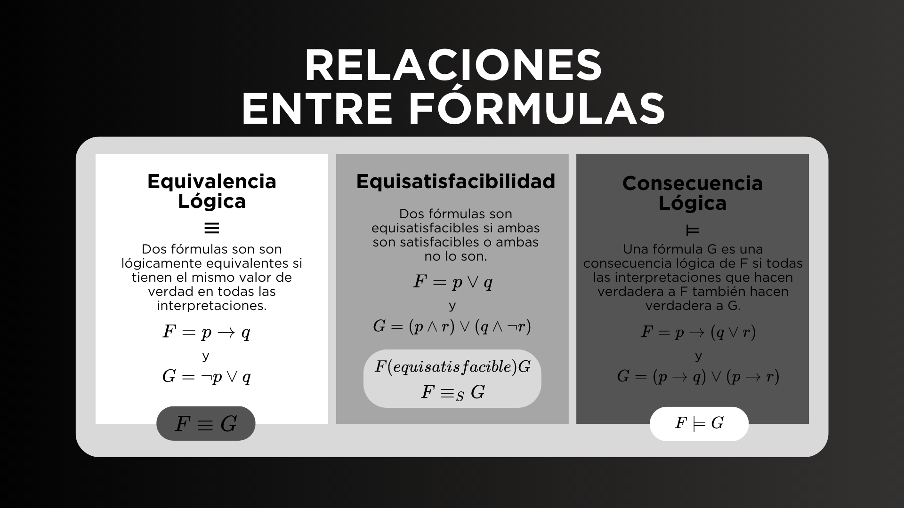

### Equivalencia Lógica

Dos WFFs F y G son lógicamente equivalentes (escrito F ≡ G) si todas las interpretaciones evalúan al mismo valor de verdad en ambos WFFs.

**Ejemplo 1:** Sean F = p ∧ ¬(q ∨ r) y G = p ∧ (¬q ∧ ¬r). Ambas fórmulas tienen el mismo conjunto de proposiciones (p, q, r). Verificamos que ambas evaluan al mismo valor de verdad en todas las interpretaciones.

**Leyes de Equivalencia Lógica:**

- **Idempotencia de la conjunción:** α ∧ α ≡ α
- **Idempotencia de la disyunción:** α ∨ α ≡ α
- **Absorción de la conjunción:** α ∧ (α ∨ β) ≡ α
- **Absorción de la disyunción:** α ∨ (α ∧ β) ≡ α
- **Doble negación:** ¬(¬α) ≡ α
- **Ley de De Morgan para la conjunción:** ¬(α ∧ β) ≡ ¬α ∨ ¬β
- **Ley de De Morgan para la disyunción:** ¬(α ∨ β) ≡ ¬α ∧ ¬β
- **Conmutatividad de la conjunción:** α ∧ β ≡ β ∧ α
- **Conmutatividad de la disyunción:** α ∨ β ≡ β ∨ α
- **Asociatividad de la conjunción:** (α ∧ β) ∧ γ ≡ α ∧ (β ∧ γ)
- **Asociatividad de la disyunción:** (α ∨ β) ∨ γ ≡ α ∨ (β ∨ γ)
- **Distributividad de la conjunción:** α ∧ (β ∨ γ) ≡ (α ∧ β) ∨ (α ∧ γ)
- **Distributividad de la disyunción:** α ∨ (β ∧ γ) ≡ (α ∨ β) ∧ (α ∨ γ)
- **Contraposición lógica:** α → β ≡ ¬β → ¬α
- **Implicación material:** α → β ≡ ¬α ∨ β
- **Definición de equivalencia material:** α ↔ β ≡ (α → β) ∧ (β → α)

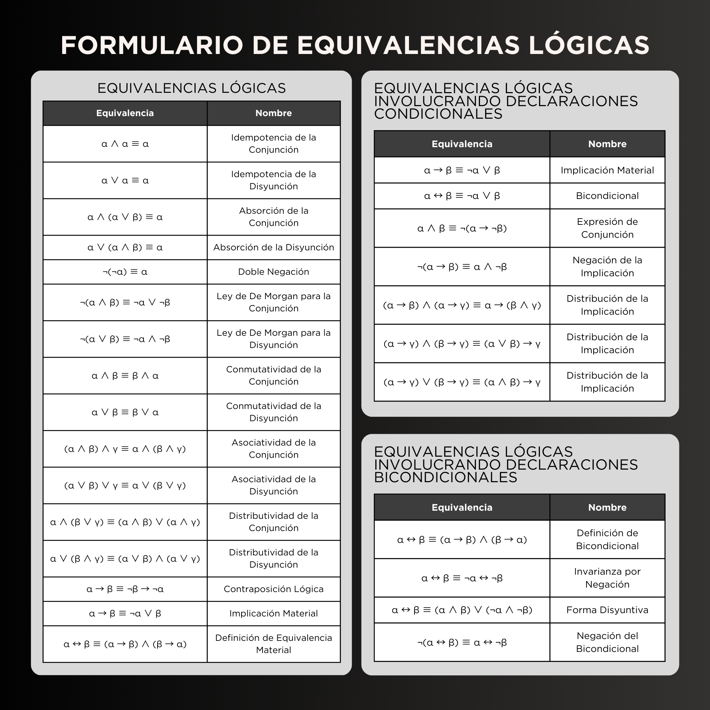

### Equisatisfacibilidad

Dos WFFs F y G son equisatisfacibles cuando F es satisfacible si y solo si G también lo es.

**Ejemplo:** Sean F = p ∨ q y G = (p ∨ r) ∧ (q ∨ ¬r). Verificamos que ambas son satisfacibles.

### Consecuencia Lógica

Dos WFFs F y G tienen la relación de consecuencia lógica (escrito G ⊨ F) si todas las interpretaciones que hacen verdadera a G también hacen verdadera a F. Esto significa que G implica lógicamente a F.

**Nota:** Esta relación se puede verificar usando tablas de verdad o pruebas formales en lógica proposicional.

### Análisis Lógico del Lenguaje

La **verificación de consistencia** es una herramienta importante para detectar contradicciones en un razonamiento. Aunque no es difícil verificar la consistencia de enunciados formalizados, el lenguaje natural tiene muchos matices y ambigüedades. La **lógica de predicados de primer orden** permite modelar expresiones complejas, pero la **lógica proposicional** a menudo es suficiente para detectar inconsistencias en discursos, como en contextos políticos o judiciales.

### Problemas Industriales

La lógica proposicional es útil para modelar problemas reales. Si una fórmula es satisfacible, sus modelos pueden representar soluciones. Si no, podría estar mal planteado. Entre las aplicaciones prácticas de la lógica proposicional encontramos:

- Diseño de circuitos
- Verificación de software
- Planificación industrial
- Generación de horarios
- Verificación de dependencias de paquetes

### Tableaux Semántico

El método de **tableaux semántico** se utiliza para determinar si una fórmula es una **contingencia**, una **tautología** o una **contradicción**. Este método despliega sistemáticamente las condiciones de verdad de la fórmula o fórmulas, con una estructura similar a un árbol.

- Cada **rama** del árbol representa una posible situación.
- Las ramas se cierran cuando hay contradicciones, lo que indica una posibilidad inviable.
- Un árbol completamente desarrollado con todas las ramas cerradas demuestra que la fórmula no es satisfacible.
- Una **rama abierta** indica que existe una interpretación que satisface la fórmula.

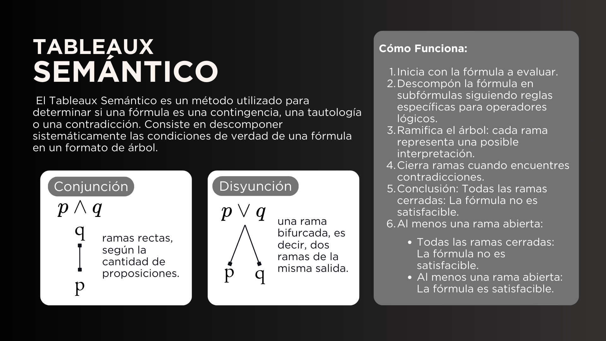

## El Problema de Satisfacibilidad (SAT)

El **Problema de Satisfacibilidad Booleana (SAT)** consiste en decidir si una fórmula bien formada (wff) es satisfacible, es decir, si existe una asignación de valores (verdadero o falso) a sus proposiciones que haga la fórmula verdadera.

- El método de **tablas de verdad** es útil para determinar si una fórmula es satisfacible, pero no es escalable, ya que su complejidad es **exponencial** en función del número de variables.

.png)

### Escalabilidad del método:

- Si hay **n** variables, se necesitan 2n combinaciones de valores.
    
    2n2^n
    
    - Si n=10, se necesitan 1024 combinaciones.
        
        n=10n = 10
        
    - Si n=20, se necesitan 1,048,576 combinaciones.
        
        n=20n = 20
        

### Complejidad Computacional y SAT:

El problema SAT es **NP-completo**, lo que significa que no existe un algoritmo eficiente conocido para resolver todos los casos. Si se encontrara un algoritmo en tiempo polinomial para SAT, permitiría resolver muchos otros problemas en NP de forma eficiente.

### **P (Polynomial Time)**

Un problema es NP-completo si es tan difícil como cualquier otro problema en NP (donde las soluciones pueden ser verificadas en tiempo polinomial) y tiene una solución en tiempo polinomial si se resuelve uno de estos problemas.

### **NP-completo (Nondeterministic Polynomial Time Complete)**

Un problema es **NP-completo** si es **tan difícil como cualquier otro problema en NP** (donde las soluciones pueden ser verificadas en tiempo polinomial) y **tiene una solución en tiempo polinomial** si se resuelve uno de estos problemas.

| **Clase de Complejidad** | **Característica Principal** |
| --- | --- |
| **P** | Fácilmente resoluble en tiempo polinómico. |
| **NP** | Sí, las respuestas se pueden verificar en tiempo polinómico. |
| **Co-NP** | No, las respuestas no se pueden verificar en tiempo polinómico. |
| **NP-hard** | Todos los problemas NP-hard no están necesariamente en NP y es difícil verificarlos. |
| **NP-completo** | Un problema que es tanto NP como NP-hard. |

.png)

## Formas Normales

### Forma Normal Conjuntiva (CNF)

Una fórmula está en **Forma Normal Conjuntiva (CNF)** si es una conjunción de cláusulas, y cada cláusula es una disyunción de literales. No debe haber literales repetidos en una cláusula. 

### Forma Normal Disyuntiva (DNF)

Una fórmula está en **Forma Normal Disyuntiva (DNF)** si es una disyunción de conjunciones, y no hay literales repetidos en ninguna conjunción. 

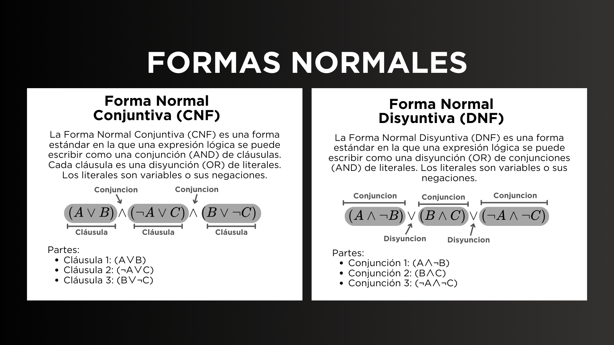

## SAT Solver

**Un SAT Solver (Satisfiability Solver) es un algoritmo diseñado para determinar si una fórmula lógica proposicional en forma normal conjuntiva (CNF) tiene una asignación de valores de verdad que la haga verdadera.** En otras palabras, busca si existe una solución que satisfaga todas las cláusulas de la fórmula.

```python
# la forma estándar de importar PySAT:
from pysat.formula import CNF
from pysat.solvers import Solver

# crear una fórmula CNF satisfacible "(-x1 ∨ x2) ∧ (-x1 ∨ -x2)":
cnf = CNF(from_clauses=[[-1, 2], [-1, -2]])

# crear un solucionador SAT para esta fórmula:
with Solver(bootstrap_with=cnf) as solver:
    # 1.1 llama al solucionador para esta fórmula:
    print('la fórmula es', f'{"s" si solver.solve() else "ins"}atisfacible')

    # 1.2 la fórmula es satisfacible, por lo tanto tiene un modelo:
    print('y el modelo es:', solver.get_model())

    # 2.1 aplica la interfaz de suposiciones al estilo MiniSat:
    print('la fórmula es',
        f'{"s" si solver.solve(assumptions=[1, 2]) else "ins"}atisfacible',
        'suponiendo x1 y x2')

    # 2.2 la fórmula es insatisfacible,
    # es decir, se puede extraer un núcleo insatisfacible:
    print('y el núcleo insatisfacible es:', solver.get_core())
```

### Transformación de Tseitin

El proceso de **Transformación de Tseitin** permite convertir una fórmula en CNF de manera que sea **equisatisfacible**, es decir, que la nueva fórmula tiene las mismas soluciones que la original. Esta transformación asegura que el tamaño de la fórmula resultante crezca linealmente en función del tamaño de la fórmula original, mejorando la eficiencia en la resolución de SAT.

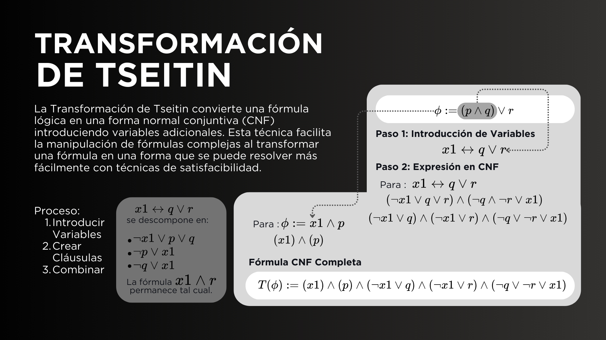

## Demostración de Teoremas

La **demostración de teoremas** es un proceso matemático en el cual se utiliza la deducción a partir de axiomas para probar la validez de un teorema. Este proceso es clave en matemáticas y ciencias para asegurar que los resultados sean correctos.

## Forma Clausal

Una fórmula en **forma clausal** es un conjunto de cláusulas, y estas a su vez son disyunciones de literales. En una fórmula bien formada (wff) en CNF, las cláusulas representan una conjunción de literales. 

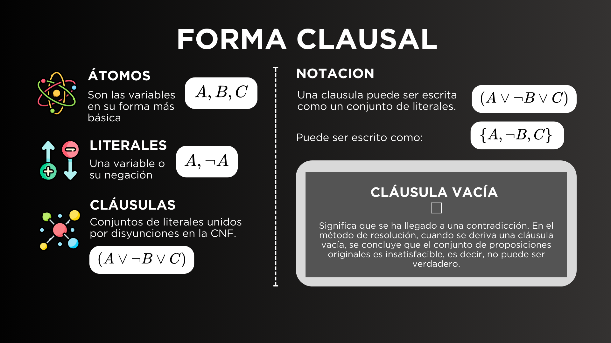

### Propiedades de la forma clausal:

- Una proposición es un átomo.
Ejemplo: p , q , r
- En literal es un átomo o un átomo negado.
Ejemplo: p, ¬q, r
- Una clausula es un disyunción de literales.
Ejemplo: p ∨ ¬q ∨ r

### Cláusula Vacía □

La **cláusula vacía**, representada como □, no contiene literales y es insatisfacible.

### Método de Resolución

El **método de resolución** es una técnica utilizada para determinar la satisfacibilidad de un conjunto de cláusulas. Este método se basa en la manipulación de fórmulas en forma clausal para derivar nuevas cláusulas. Si se deriva una **cláusula vacía**, se concluye que el conjunto original de cláusulas es **insatisfacible**.

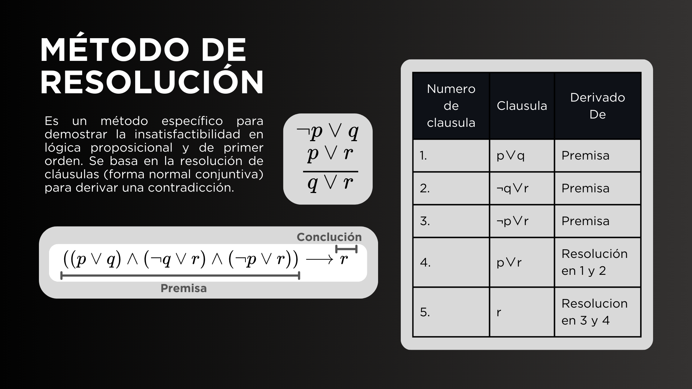

### Regla de Resolución:

- Sea A∨C_1 una cláusula en P.
- Sea ¬A∨C_2 una cláusula en P.
- Entonces, C_1∨C_2 es una cláusula derivada de P (resolvente).

Una **regla de inferencia** es un principio lógico que permite derivar una conclusión válida a partir de una o más premisas. Es una herramienta que garantiza que si las premisas son verdaderas, la conclusión también lo será.

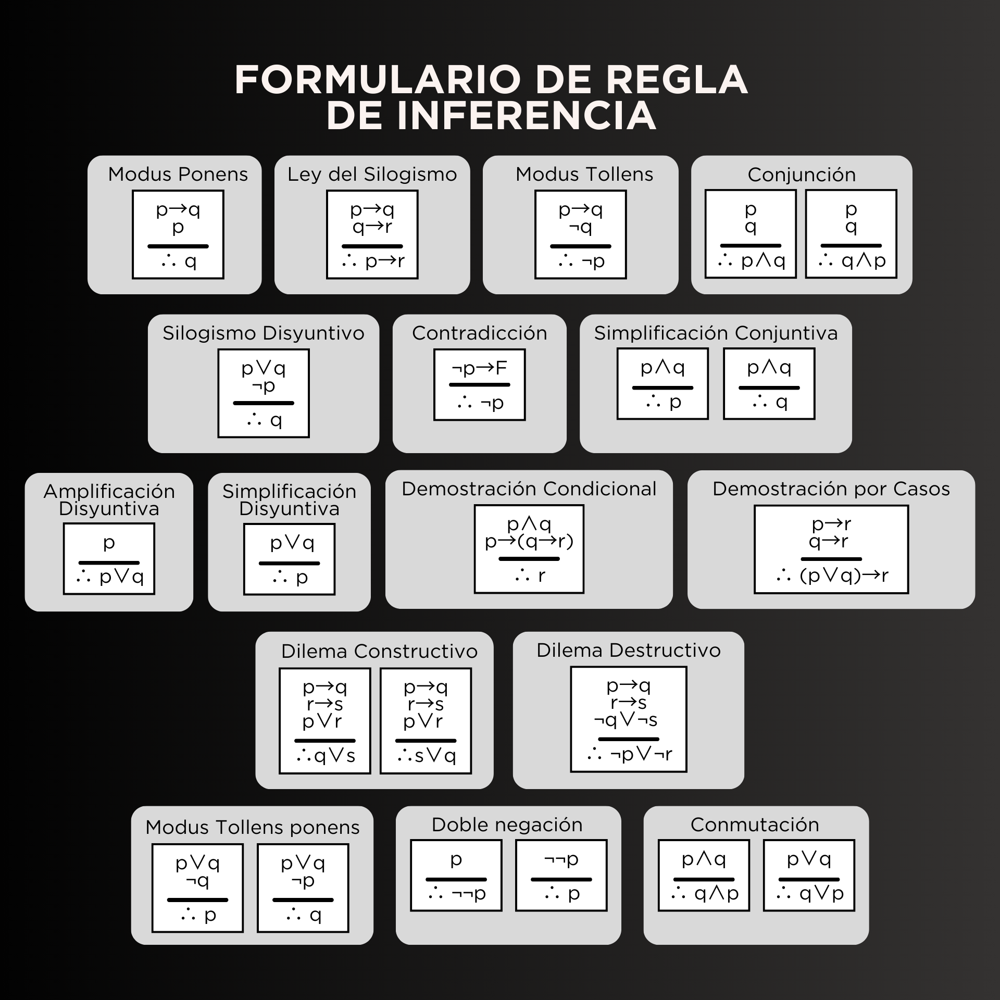

### Prueba por Refutación

La **resolución** se utiliza generalmente para demostrar una consecuencia lógica mediante **refutación**. Si queremos demostrar que P⊨R, es decir, que P→R es una tautología, aplicamos la resolución a P∧¬R (cuando ambos están en CNF).

La **completitud refutacional** garantiza que si una fórmula en CNF es insatisfacible, se puede demostrar mediante la resolución.

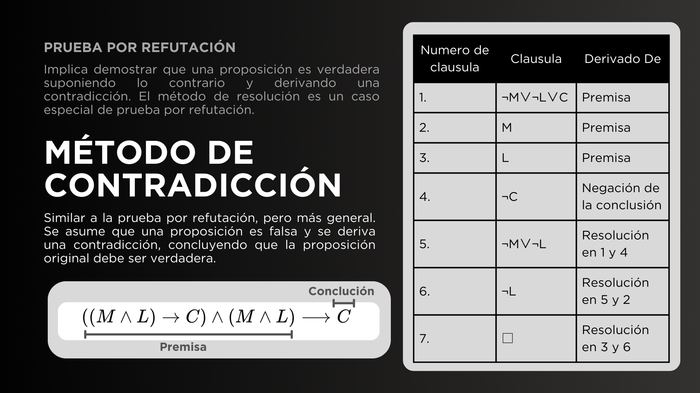

## Función Proposicional

Una **función proposicional** (o **predicado**) respecto a un conjunto **D** es una expresión **P(x)** que incluye la variable **x**. Para cada **x** en **D**, **P(x)** es una proposición. **D** es el dominio de discurso (o dominio de referencia) de **P**.

## Símbolos en Lógica de Predicados

Los símbolos usados en lógica de predicados son:

- **Conjunto de símbolos constantes**  C : {a, b, c, ...}
- **Conjunto de símbolos de predicado**  P : {P, Q, R, ...}
- **Conjunto de símbolos de función** F : {f, g, h, ...}
- **Conjunto de símbolos variables**  V : {x, y, z, ...}
- **Operadores**: ∧, ∨, ¬, →, ↔
- **Cuantificadores**: ∀ (para todos), ∃ (existe)

**Prioridad de los Cuantificadores y Conectivos:**

1. Cuantificadores (∀, ∃)
2. Negación (¬)
3. Disyunción (∨) y Conjunción (∧)
4. Implicación (→) y Doble implicación (↔)

## Cuantificadores

- **Cuantificador Universal (∀)**: Se lee "para todos".
- **Cuantificador Existencial (∃)**: Se lee "existe".

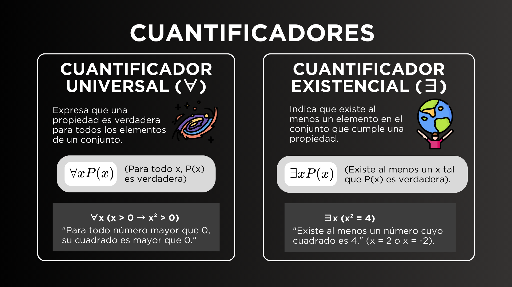

**Precedencia de los Cuantificadores:**

- El símbolo **¬** se evalúa primero.
- Los operadores **∧** y **∨** se evalúan a continuación.
- Los cuantificadores se evalúan después.
- Los operadores **→** y **↔** se evalúan por último.

### **Cuantificador Universal (∀)**

El **cuantificador universal** se usa para afirmar que una proposición es verdadera para todos los elementos de un dominio de discurso. Se representa como ∀x P(x), que significa "para toda x, P(x)".

- **Ejemplo**:
Si P(x) es "x es un número natural", y el dominio es D = {2, 3, 4, 5}, entonces ∀x P(x) es verdadero porque cada número en ese dominio es un número natural.
Si el dominio es el conjunto de los números reales D = ℝ, la afirmación ∀x P(x) sería falsa, ya que hay números como 2.5 que no son naturales.

### **Contraejemplo**

Un **contraejemplo** es un valor en el dominio que demuestra que una afirmación universal es falsa. Si ∀x P(x) es falso, entonces existe un contraejemplo que hace falsa la proposición P(x).

- **Ejemplo**:
Si P(x) es "x es un número par" y el dominio es el conjunto de los números naturales, un contraejemplo sería x = 3, porque 3 no es un número par.

### **Cuantificador Existencial (∃)**

El **cuantificador existencial** se usa para afirmar que existe al menos un elemento en el dominio que satisface una proposición. Se representa como ∃x P(x), que significa "existe x tal que P(x)".

- **Ejemplo**:
Si P(x) es "x es un número primo" y el dominio es el conjunto de los números reales, ∃x P(x) es verdadero porque existe al menos un número real (como 2) que es primo.

### **Negación de Cuantificadores**

La negación de los cuantificadores cambia el tipo de cuantificación:

1. La negación de ∀x P(x) es equivalente a ∃x ¬P(x), es decir, si no es cierto que P(x) es verdadera para todos, existe al menos un x para el cual P(x) es falsa.
2. La negación de ∃x P(x) es equivalente a ∀x ¬P(x), es decir, si no existe ningún x para el cual P(x) es verdadera, entonces P(x) es falsa para todos los x.
- **Ejemplo**:
Si P(x) es "x es mayor que 5" y el dominio es {1, 2, 3}, la negación de ∃x P(x) sería ∀x ¬P(x), es decir, "todos los elementos del dominio son menores o iguales a 5", lo cual sería verdadero.

### Variables Libres y Ligadas

Las fórmulas se clasifican en:

- **Formulas Abiertas**: Tienen al menos una variable libre.
- **Formulas Cerradas (o Sentencias)**: No tienen variables libres.

**Variables Ligadas:** Una variable **x** en una fórmula **φ** es ligada si está afectada por algún cuantificador.

**Variables Libres:** Una variable **x** es libre si no está afectada por ningún cuantificador.